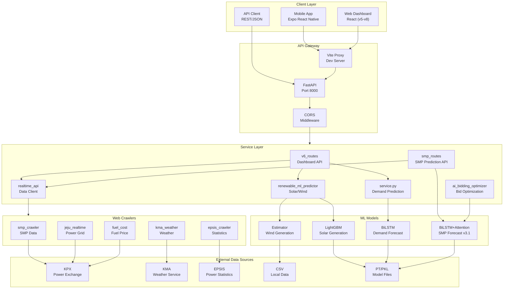

# RE-BMS System Architecture

> RE-BMS 제주 전력 수요 예측 시스템 아키텍처 문서
>
> Last Updated: 2024-12-24

## Overview

RE-BMS(Renewable Energy Bidding Management System)는 제주도 전력 수요 예측 및 SMP(계통한계가격) 예측을 기반으로 한 전력 입찰 관리 시스템입니다.

## System Architecture Diagram



## Layer Details

### 1. Client Layer

| Component | Technology | Description |
|-----------|------------|-------------|
| Mobile App | Expo React Native | iOS/Android 모바일 앱 (Port 8081) |
| Web Dashboard | React + Vite | 웹 대시보드 (v5-v8 버전) |
| API Client | REST/JSON | 외부 API 클라이언트 |

### 2. API Gateway

| Component | Technology | Port | Description |
|-----------|------------|------|-------------|
| Vite Proxy | Vite Dev Server | 8508-8509 | 개발 서버 프록시 |
| FastAPI | Python FastAPI | 8000 | 메인 API 서버 |
| CORS | Middleware | - | Cross-Origin 요청 처리 |

### 3. Service Layer

| File | Endpoint Prefix | Description |
|------|-----------------|-------------|
| `v6_routes.py` | `/api/v1/` | 대시보드 KPI, 리소스, 정산 API |
| `smp_routes.py` | `/api/v1/smp/` | SMP 예측 API (핵심) |
| `realtime_api.py` | - | 실시간 데이터 클라이언트 |
| `ai_bidding_optimizer.py` | `/api/v1/bidding/` | AI 기반 입찰 최적화 |
| `renewable_ml_predictor.py` | - | 태양광/풍력 발전량 예측 |
| `service.py` | `/api/v1/predict/` | 전력 수요 예측 |

### 4. Web Crawlers

| Crawler | Source | Data |
|---------|--------|------|
| `smp_crawler.py` | KPX | 실시간 SMP 가격 |
| `jeju_realtime_crawler.py` | KPX | 제주 실시간 전력수급 |
| `kma_weather_crawler.py` | 기상청 | 실시간 기상 데이터 |
| `epsis_crawler.py` | EPSIS | 전력 통계 데이터 |
| `fuel_cost_crawler.py` | KPX | 연료비 데이터 |

### 5. ML Models

| Model | Type | Input | Output | Performance |
|-------|------|-------|--------|-------------|
| **SMP Predictor** | BiLSTM+Attention v3.1 | SMP history, Weather, Demand | 24h SMP (q10, q50, q90) | MAPE 7.83% |
| **Demand Predictor** | BiLSTM | Demand history, Calendar | 24h Demand | MAPE 6.32% |
| **Solar Predictor** | LightGBM | Weather, Calendar | Solar generation | R² 0.92 |
| **Wind Estimator** | Rule-based | Wind speed, Capacity | Wind generation | - |

### 6. External Data Sources

| Source | URL | Data Type |
|--------|-----|-----------|
| KPX (전력거래소) | kpx.or.kr | SMP, 전력수급, 입찰 |
| KMA (기상청) | weather.go.kr | 기상 관측/예보 |
| EPSIS (전력통계) | epsis.kpx.or.kr | 전력 통계 |
| Local CSV | data/*.csv | 학습 데이터 |
| Model Files | models/*.pt | 학습된 모델 |

## Data Flow

```
[External Sources] → [Web Crawlers] → [realtime_api.py]
                                            ↓
[ML Models] ← [Service Layer] ← [API Gateway] ← [Client Apps]
     ↓              ↓
[Predictions]  [Optimization]
```

## Key API Endpoints

### SMP Prediction
```
GET /api/v1/smp-forecast
Response: { q10: [], q50: [], q90: [], model_used: "BiLSTM+Attention v3.1" }
```

### AI Bidding Optimization
```
GET /api/v1/bidding/optimized-segments?capacity_mw=50&risk_level=moderate
Response: { hourly_bids: [...], optimization_method: "Quantile-based Probabilistic" }
```

### Demand Prediction
```
POST /api/v1/predict/24h
Response: { predictions: [...], model: "BiLSTM v19" }
```

## File Structure

```
power-demand-forecast/
├── api/                          # FastAPI Backend
│   ├── main.py                   # Application entry
│   ├── v6_routes.py              # Dashboard API
│   ├── smp_routes.py             # SMP Prediction API
│   ├── ai_bidding_optimizer.py   # AI Optimization
│   ├── realtime_api.py           # Data Client
│   ├── renewable_ml_predictor.py # Solar/Wind ML
│   └── service.py                # Demand Prediction
├── src/
│   └── smp/
│       ├── models/               # ML Model Classes
│       │   └── smp_predictor.py  # SMP Predictor
│       └── crawlers/             # Web Crawlers
├── models/                       # Trained Models (.pt, .pkl)
├── mobile/                       # Expo React Native App
├── web-v6/                       # React Web Dashboard
└── docs/                         # Documentation
```

## FigJam Diagram

[View Interactive Diagram on FigJam](https://www.figma.com/online-whiteboard/create-diagram/e715ac73-7b60-48a7-a38c-2a63a4ccd6bf)
