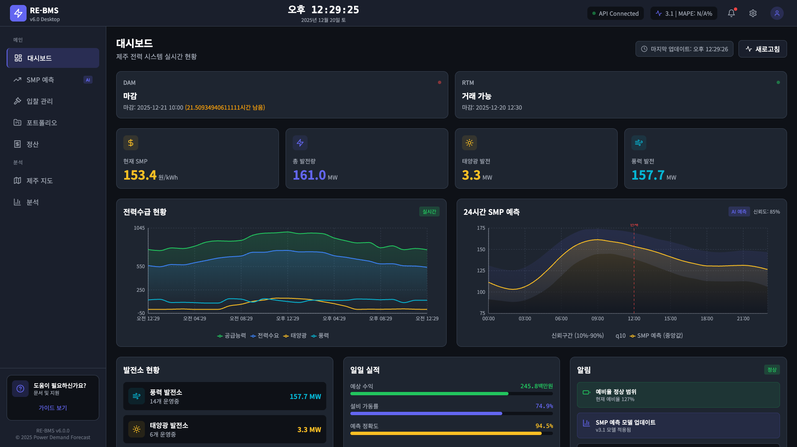
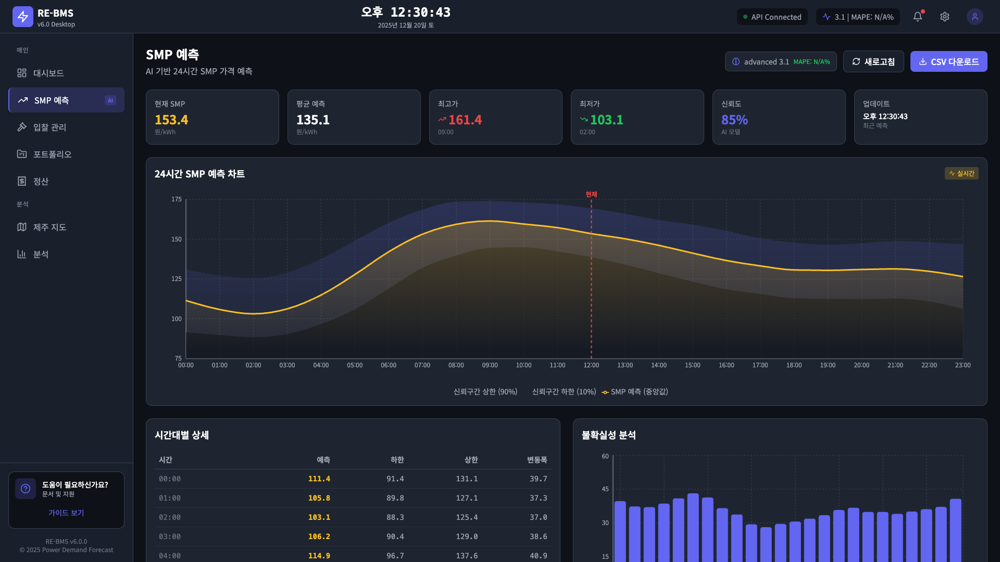
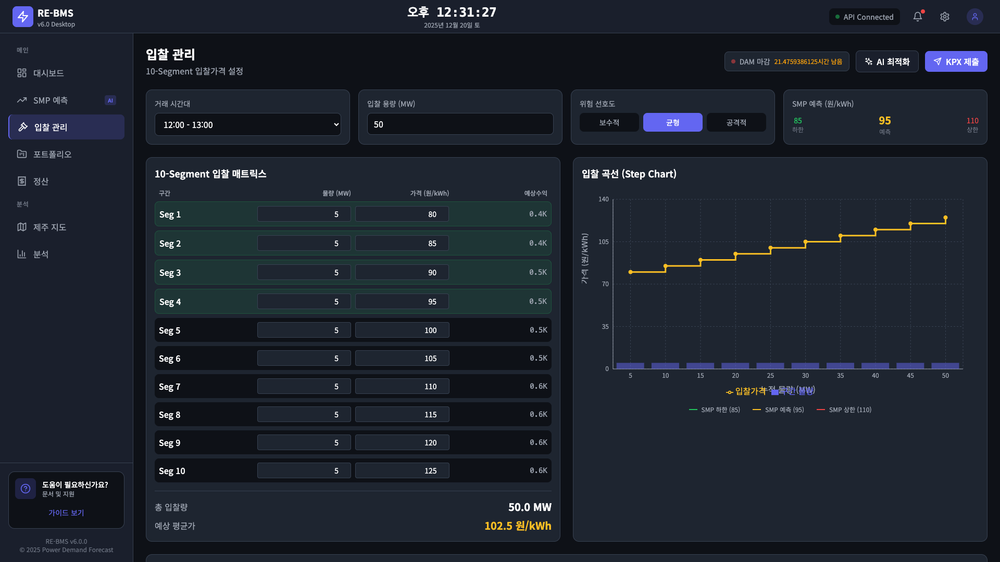

# RE-BMS v6.0 - React Desktop Web Application

> **Renewable Energy Bidding Management System** - Desktop Web Dashboard

[](https://react.dev/)
[](https://www.typescriptlang.org/)
[](https://vitejs.dev/)
[](https://tailwindcss.com/)

## Overview

RE-BMS v6.0은 제주도 재생에너지 입찰 관리 시스템의 데스크톱 웹 버전입니다. v4 Streamlit 대시보드의 기능을 React + TypeScript로 재구현하여 더 빠르고 반응형인 사용자 경험을 제공합니다.

### Key Features

- **실시간 SMP 예측**: EPSIS 데이터 기반 24시간 SMP 예측 (q10/q50/q90)
- **10-Segment 입찰 관리**: KPX DAM/RTM 시장 입찰 최적화
- **포트폴리오 관리**: 제주도 20개 발전소 모니터링
- **정산 분석**: 수익 및 불균형 정산 현황
- **지도 시각화**: Leaflet 기반 발전소 위치 표시

---

## Screenshots

### Main Dashboard

*실시간 KPI, SMP 예측 차트, 전력수급 현황*

### SMP Prediction

*24시간 SMP 예측 with 신뢰구간 (10%-90%)*

### Bidding Management

*10-Segment 입찰 매트릭스 및 Step Chart*

---

## Quick Start

### Prerequisites

- Node.js 18+
- npm 9+
- FastAPI Backend (port 8506)

### Installation

```bash
# Navigate to web-v6 directory
cd web-v6

# Install dependencies
npm install

# Start development server
npm run dev
```

### Access

- **Web App**: http://localhost:8508
- **API Proxy**: /api/* → http://localhost:8506

---

## Project Structure

```
web-v6/
├── src/
│   ├── components/
│   │   ├── Layout/
│   │   │   ├── Layout.tsx      # Main layout with sidebar
│   │   │   ├── Header.tsx      # Top navigation bar
│   │   │   └── Sidebar.tsx     # Side navigation menu
│   │   ├── Charts/
│   │   │   ├── SMPChart.tsx    # SMP forecast chart
│   │   │   └── PowerSupplyChart.tsx
│   │   └── Cards/
│   │       └── KPICard.tsx     # Reusable KPI card
│   │
│   ├── pages/
│   │   ├── Dashboard.tsx       # Main dashboard
│   │   ├── SMPPrediction.tsx   # SMP forecast page
│   │   ├── Bidding.tsx         # 10-segment bidding
│   │   ├── Portfolio.tsx       # Resource management
│   │   ├── Settlement.tsx      # Revenue settlement
│   │   ├── Map.tsx             # Jeju map with markers
│   │   └── Analysis.tsx        # XAI analysis
│   │
│   ├── hooks/
│   │   └── useApi.ts           # Custom API hooks
│   │
│   ├── services/
│   │   └── api.ts              # API service with fallbacks
│   │
│   ├── types/
│   │   └── index.ts            # TypeScript interfaces
│   │
│   ├── App.tsx                 # Main router
│   ├── main.tsx                # Entry point
│   └── index.css               # Global styles
│
├── vite.config.ts              # Vite configuration
├── tailwind.config.js          # Tailwind CSS config
├── tsconfig.json               # TypeScript config
└── package.json                # Dependencies
```

---

## API Endpoints

v6 React 앱은 FastAPI 백엔드의 `/api/v1/*` 엔드포인트를 사용합니다.

| Endpoint | Method | Description |
|----------|--------|-------------|
| `/api/v1/smp-forecast` | GET | 24시간 SMP 예측 (q10/q50/q90) |
| `/api/v1/dashboard/kpis` | GET | 대시보드 KPI |
| `/api/v1/market-status` | GET | DAM/RTM 시장 상태 |
| `/api/v1/resources` | GET | 제주 발전소 목록 (20개) |
| `/api/v1/model/info` | GET | 모델 정보 |
| `/api/v1/health` | GET | API 상태 확인 |

### API Response Example

```json
// GET /api/v1/smp-forecast
{
  "q10": [62.67, 75.49, ...],
  "q50": [77.95, 71.16, ...],
  "q90": [93.23, 86.83, ...],
  "hours": [1, 2, ..., 24],
  "model_used": "LSTM-Attention v3.1 + EPSIS Real Data",
  "confidence": 0.92,
  "data_source": "EPSIS (epsis.kpx.or.kr)"
}
```

---

## Data Sources

### Real-Time Data

| Source | Data | Update Frequency |
|--------|------|------------------|
| **EPSIS** | SMP (육지/제주) | 매시간 자동 수집 |
| **KPX** | 시장 상태, 입찰 마감 | 실시간 |

### Scheduler

SMP 데이터는 `src/smp/crawlers/scheduler.py`에 의해 자동 수집됩니다.

```bash
# 스케줄러 상태 확인
./scripts/manage_scheduler.sh status

# 즉시 크롤링
./scripts/manage_scheduler.sh run-now
```

---

## Tech Stack

| Category | Technology |
|----------|------------|
| **Framework** | React 18.3 |
| **Language** | TypeScript 5.6 |
| **Build Tool** | Vite 5.4 |
| **Styling** | Tailwind CSS 3.4 |
| **Charts** | Recharts 2.13 |
| **Maps** | React Leaflet 4.2 |
| **Icons** | Lucide React |
| **Routing** | React Router 6.28 |
| **HTTP Client** | Fetch API |

---

## Development

### Commands

```bash
# Development server
npm run dev

# Build for production
npm run build

# Preview production build
npm run preview

# Type checking
npm run lint
```

### Proxy Configuration

`vite.config.ts`에서 API 프록시가 설정되어 있습니다:

```typescript
export default defineConfig({
  server: {
    port: 8508,
    proxy: {
      '/api': {
        target: 'http://localhost:8506',
        changeOrigin: true,
      },
    },
  },
})
```

---

## Version History

| Version | Date | Changes |
|---------|------|---------|
| **6.0.0** | 2025-12-20 | Initial React desktop web application |
| **6.0.1** | 2025-12-20 | Real EPSIS data integration |
| **6.0.2** | 2025-12-20 | Crawler scheduler integration |

---

## Related Projects

| Version | Type | Port | Description |
|---------|------|------|-------------|
| **v4** | Streamlit | 8504 | Python 대시보드 |
| **v5** | React Native | 8507 | 모바일 앱 |
| **v6** | React Web | 8508 | 데스크톱 웹 앱 |

---

## License

MIT License - see [LICENSE](../LICENSE) for details.
